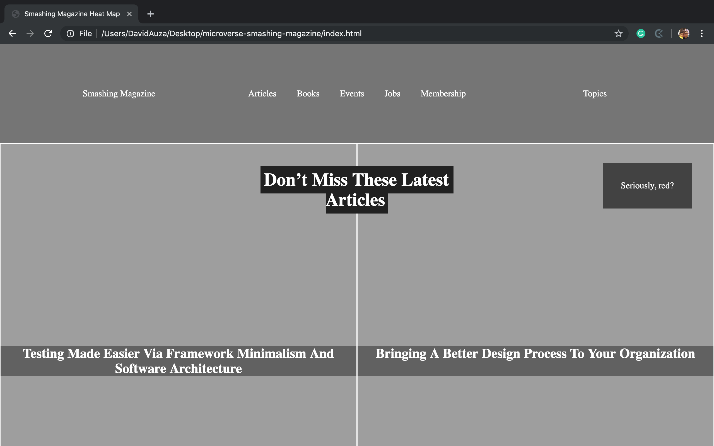
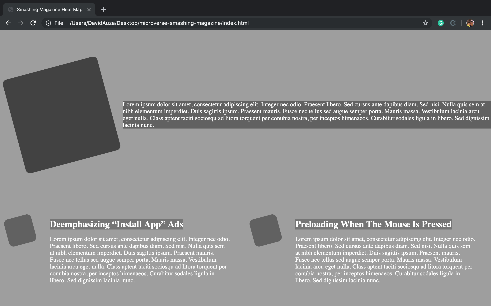

# Design Teardown

This is our solution to Microverse's fifth project. It is a heat map of Smashing Magazine's site as shown on August 23, 2019. The current Smashing Magazine's site is found [here](https://www.smashingmagazine.com/). It is created using HTML5 and CSS3.

A live version can be found [here](https://rawcdn.githack.com/eduardoreisalvarenga/microverse-smashing-magazine/45b6ec9bcfae71b8fe5a1d5833a35266d2bb71b3/index.html).

## Project contributors:

- [David Auza](https://github.com/davidauza-engineer)

- [Eduardo Reis](https://github.com/eduardoreisalvarenga)

## Screenshots

### Screenshot 1

### Screenshot 2

